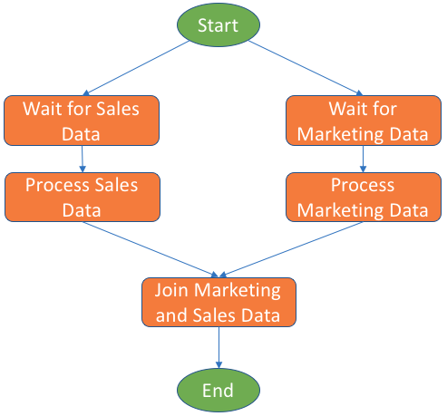
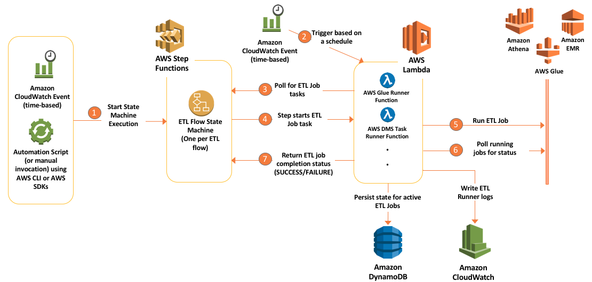
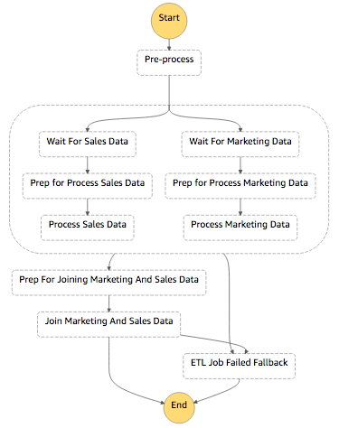
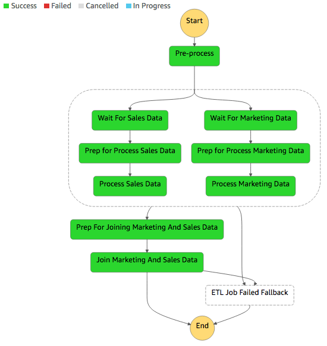

AWS ETL Orchestrator
========

##Introduction
Extract, transform, and load (ETL) operations collectively form the backbone of any modern enterprise data lake. It transforms raw data into useful datasets and, ultimately, into actionable insight. An ETL job typically reads data from one or more data sources, applies various transformations to the data, and then writes the results to a target where data is ready for consumption. The sources and targets of an ETL job could be relational databases in Amazon Relational Database Service (Amazon RDS) or on-premises, a data warehouse such as Amazon Redshift, or object storage such as Amazon Simple Storage Service (Amazon S3) buckets. Amazon S3 as a target is especially commonplace in the context of building a data lake in AWS.

AWS offers [AWS Glue](https://aws.amazon.com/glue/), which is a service that helps author and deploy ETL jobs. AWS Glue is a fully managed extract, transform, and load service that makes it easy for customers to prepare and load their data for analytics. Other AWS Services also can be used to implement and manage ETL jobs. They include: [AWS Database Migration Service](https://docs.aws.amazon.com/dms/latest/userguide/Welcome.html) (AWS DMS), [Amazon EMR](https://docs.aws.amazon.com/emr/latest/ManagementGuide/emr-what-is-emr.html) (using the Steps API), and even [Amazon Athena](https://docs.aws.amazon.com/athena/latest/ug/what-is.html).


## The challenge of orchestrating an ETL workflow

How can we orchestrate an ETL workflow that involves a diverse set of ETL technologies? AWS Glue, AWS DMS, Amazon EMR, and other services support [Amazon CloudWatch Events](https://docs.aws.amazon.com/AmazonCloudWatch/latest/events/WhatIsCloudWatchEvents.html), which we could use to chain ETL jobs together. Amazon S3, the central data lake store, also supports CloudWatch Events. But relying on CloudWatch Events alone means that there's no single visual representation of the ETL workflow. Also, tracing the overall ETL workflow's execution status and handling error scenarios can become a challenge.

In this code sample, I show you how to use [AWS Step Functions](https://docs.aws.amazon.com/step-functions/latest/dg/welcome.html) and [AWS Lambda](https://docs.aws.amazon.com/lambda/latest/dg/welcome.html) for orchestrating multiple ETL jobs involving a diverse set of technologies in an arbitrarily-complex ETL workflow. AWS Step Functions is a web service that enables you to coordinate the components of distributed applications and microservices using visual workflows. You build applications from individual components. Each component performs a discrete function, or task, allowing you to scale and change applications quickly. Using AWS Step Functions also opens up opportunities for integrating other AWS or external services into your ETL flows. Let’s take an example ETL flow for illustration.

## Example ETL workflow requirements

For our example, we'll use two publicly-available [Amazon QuickSight](https://docs.aws.amazon.com/quicksight/latest/user/welcome.html) datasets. The first dataset is a [sales pipeline dataset](samples/SalesPipeline_QuickSightSample.csv) (Sales dataset) that contains a list of slightly above 20K sales opportunity records for a fictitious business. Each record has fields that specify:

* A date, potentially when an opportunity was identified. 
* The salesperson’s name. 
* A market segment to which the opportunity belongs. 
* Forecasted monthly revenue. 

The second dataset is an [online marketing metrics dataset](samples/MarketingData_QuickSightSample.csv) (Marketing dataset). The data set contains records of marketing metrics, aggregated by day. The metrics describe user engagement across various channels (website, mobile, and social media) plus other marketing metrics. The two data sets are unrelated, but we’ll assume that they are for the purpose of this example. 

Imagine there’s a business user who needs to answer questions based on both datasets. Perhaps the user wants to explore the correlations between online user engagement metrics on the one hand, and forecasted sales revenue and opportunities generated on the other hand. The user engagement metrics include website visits, mobile users, and desktop users.

The steps in the ETL flow chart are: 

1. **Process the Sales dataset.** Read Sales dataset. Group records by day, aggregating the Forecasted Monthly Revenue field. Rename fields to replace white space with underscores. Output the intermediary results to Amazon S3 in compressed Parquet format. Overwrite any previous outputs. 

2. **Process the Marketing dataset.** Read Marketing dataset. Rename fields to replace white space with underscores. Output the intermediary results to Amazon S3 in compressed Parquet format. Overwrite any previous outputs. 

3. **Join Sales and Marketing datasets.** Read outputs of processing Sales and Marketing datasets. Perform an inner join of both datasets on the date field. Sort in ascending order by date. Output final joined dataset to Amazon S3, overwriting any previous outputs. 
Solution Architecture

So far, this ETL workflow can be implemented with AWS Glue, with the ETL jobs being chained by using job triggers. But you might have other requirements outside of AWS Glue that are part of your end-to-end data processing workflow, such as the following:

* Both Sales and Marketing datasets are uploaded to an S3 bucket at random times in an interval of up to a week. The PSD and PMD jobs should start as soon as the Sales dataset file is uploaded. Parallel ETL jobs can start and finish anytime, but the final JMSD job can start only after all parallel ETL jobs are complete.
* In addition to PSD and PMD jobs, the orchestration must support more parallel ETL jobs in the future that contribute to the final dataset aggregated by the JMSD job. The additional ETL jobs could be managed by AWS services, such as AWS Database Migration Service, Amazon EMR, Amazon Athena or other non-AWS services.


The data engineer takes these requirements and builds the following ETL workflow chart.


## The ETL orchestration architecture and events
Let’s see how we can orchestrate such an ETL flow with AWS Step Functions, AWS Glue, and AWS Lambda. The following diagram shows the ETL orchestration architecture in action.



The main flow of events starts with an AWS Step Functions state machine. This state machine defines the steps in the orchestrated ETL workflow. A state machine can be triggered through [Amazon CloudWatch](https://aws.amazon.com/cloudwatch/?nc2=h_m1) based on a schedule, through the [AWS Command Line Interface (AWS CLI)](https://aws.amazon.com/cli/), or using the various AWS SDKs in an AWS Lambda function or some other execution environment.

As the state machine execution progresses, it invokes the ETL jobs. As shown in the diagram, the invocation happens indirectly through intermediary AWS Lambda functions that you author and set up in your account. We'll call this type of function an ETL Runner.

While the architecture in the diagram shows Amazon Athena, Amazon EMR, and AWS Glue, this code sample includes a single ETL Runner, labeled AWS Glue Runner Function in the diagram. You can use this ETL Runner to orchestrate AWS Glue jobs. You can also follow the pattern and implement more ETL Runners to orchestrate other AWS services or non-AWS tools.

ETL Runners are invoked by [activity tasks](https://docs.aws.amazon.com/step-functions/latest/dg/concepts-activities.html) in Step Functions. Because of the way AWS Step Functions' activity tasks work, ETL Runners need to periodically poll the AWS Step Functions state machine for tasks. The state machine responds by providing a Task object. The Task object contains inputs which enable an ETL Runner to run an ETL job.

As soon as an ETL Runner receives a task, it starts the respective ETL job. An ETL Runner maintains a state of active jobs in an [Amazon DynamoDB](https://docs.aws.amazon.com/amazondynamodb/latest/developerguide/Introduction.html) table. Periodically, the ETL Runner checks the status of active jobs. When an active ETL job completes, the ETL Runners notifies the AWS Step Functions state machine. This allows the ETL workflow in AWS Step Functions to proceed to the next step.


### Modeling the ETL orchestration workflow in AWS Step Functions

The following snapshot from the AWS Step Functions console shows our example ETL workflow modeled as a state machine. This workflow is what we provide you in the code sample. 



When you start an execution of this state machine, it will branch to run two ETL jobs in parallel: Process Sales Data (PSD) and Process Marketing Data (PMD). But, according to the requirements, both ETL jobs should not start until their respective datasets are uploaded to Amazon S3. Hence, we implement Wait activity tasks before both PSD and PMD. When a dataset file is uploaded to Amazon S3, this triggers an AWS Lambda function that notifies the state machine to exit the Wait states. When both PMD and PSD jobs are successful, the JMSD job runs to produce the final dataset.

Finally, to have this ETL workflow execute once per week, you will need to configure a state machine execution to start once per week using a CloudWatch Event.


### AWS CloudFormation templates

In this code sample, there are three separate AWS CloudFormation templates. You may choose to structure your own project similarly.

1.	A template responsible for setting up AWS Glue resources ([glue-resources.yaml](cloudformation/glue-resources.yaml)). For our example ETL flow, the sample template creates three AWS Glue jobs: PSD, PMD, and JMSD. The scripts are pulled by AWS CloudFormation from an Amazon S3 bucket that you own.
2.	A template where the AWS Step Functions state machine is defined ([step-functions-resources.yaml](cloudformation/step-functions-resources.yaml)). The state machine definition in Amazon States Language is embedded in a StateMachine resource within this template.
3.	A template that sets up Glue Runner resources ([gluerunner-resources.yaml](cloudformation/gluerunner-resources.yaml)). Glue Runner is a Python script that is written to be run as an AWS Lambda function.

For our ETL example, the `step-functions-resources.yaml` CloudFormation template creates a State Machine named `MarketingAndSalesETLOrchestrator`. You can start an execution from the AWS Step Functions console, or through an AWS CLI command.

### Handling failed Glue jobs

What if a job in the ETL workflow fails? In such a case, there are error-handling strategies available to the ETL workflow developer, from simply notifying an administrator, to fully undoing the effects of the previous jobs through compensating ETL jobs. Detecting and responding to a failed Glue job can be implemented using AWS Step Functions' Catch mechanism, which is explained in [this tutorial](https://docs.aws.amazon.com/step-functions/latest/dg/tutorial-handling-error-conditions.html). In this code sample, this state is a do-nothing [Pass](https://docs.aws.amazon.com/step-functions/latest/dg/amazon-states-language-pass-state.html) state. You can change that state into a [Task](https://docs.aws.amazon.com/step-functions/latest/dg/amazon-states-language-task-state.html) state that triggers your error-handling logic in an AWS Lambda function.


> NOTE: To make this code sample easier to setup and execute, build scripts and commands are included to help you with common tasks such as creating the above AWS CloudFormation stacks in your account. Proceed below to learn how to setup and run this example orchestrated ETL flow.


## Preparing your development environment
Here’s a high-level checklist of what you need to do to setup your development environment.

1. Sign up for an AWS account if you haven't already and create an Administrator User. The steps are published [here](http://docs.aws.amazon.com/lambda/latest/dg/setting-up.html).

2. Ensure that you have Python 2.7 and Pip installed on your machine. Instructions for that varies based on your operating system and OS version.

3. Create a Python [virtual environment](https://virtualenv.pypa.io/en/stable/) for the project with Virtualenv. This helps keep project’s python dependencies neatly isolated from your Operating System’s default python installation. **Once you’ve created a virtual python environment, activate it before moving on with the following steps**.

4. Use Pip to [install AWS CLI](http://docs.aws.amazon.com/cli/latest/userguide/installing.html). [Configure](http://docs.aws.amazon.com/cli/latest/userguide/cli-chap-getting-started.html) the AWS CLI. It is recommended that the access keys you configure are associated with an IAM User who has full access to the following:
 - Amazon S3
 - Amazon DynamoDB
 - AWS Lambda
 - Amazon CloudWatch and CloudWatch Logs
 - AWS CloudFormation
 - AWS Step Functions
 - Creating IAM Roles

 The IAM User can be the Administrator User you created in Step 1.

5. Make sure you choose a region where all of the above services are available, such as us-east-1 (N. Virginia). Visit [this page](https://aws.amazon.com/about-aws/global-infrastructure/regional-product-services/) to learn more about service availability in AWS regions.

6. Use Pip to install [Pynt](https://github.com/rags/pynt). Pynt is used for the project's Python-based build scripts.


## Configuring the project

This section list configuration files, parameters within them, and parameter default values. The build commands (detailed later) and CloudFormation templates extract their parameters from these files. Also, the  Glue Runner AWS Lambda function extract parameters at runtime from `gluerunner-config.json`.

>**NOTE: Do not remove any of the attributes already specified in these files.**

>**NOTE: You must set the value of any parameter that has the tag NO-DEFAULT** 

### cloudformation/gluerunner-lambda-params.json

Specifies parameters for creation of the `gluerunner-lambda` CloudFormation stack (as defined in `gluerunner-lambda.yaml` template). It is also used by several build scripts, including `createstack`, and `updatestack`.

```json
[
  {
    "ParameterKey": "SourceS3BucketName",
    "ParameterValue": "<NO-DEFAULT>"
  },
  {
    "ParameterKey": "SourceS3Key",
    "ParameterValue": "src/gluerunner.zip"
  },
  {
    "ParameterKey": "DDBTableName",
    "ParameterValue": "GlueRunnerActiveJobs"
  },
  {
    "ParameterKey": "GlueRunnerLambdaFunctionName",
    "ParameterValue": "gluerunner"
  }
]
```
##### Parameters:

* `SourceS3BucketName` - The Amazon S3 bucket name (without the `s3://...` prefix) from which the Glue Runner AWS Lambda function package (.zip file) will be fetched by AWS CloudFormation.

* `SourceS3Key` - The Amazon S3 key (e.g. `src/gluerunner.zip`) pointing to your AWS Lambda function's .zip package.

* `DDBTableName` - The Amazon DynamoDB table in which the state of active AWS Glue jobs is tracked between Glue Runner AWS Lambda function invocations.

* `GlueRunnerLambdaFunctionName` - The name to be assigned to the Glue Runner AWS Lambda function.


### lambda/s3-deployment-descriptor.json

Specifies the S3 buckets and prefixes for the Glue Runner lambda function (and other functions that may be added later). It is used by the `deploylambda` build script.

Sample content:

```json
{
  "gluerunner": {
    "SourceS3BucketName": "<NO-DEFAULT>",
    "SourceS3Key":"src/gluerunner.zip"
  },
  "ons3objectcreated": {
    "SourceS3BucketName": "<NO-DEFAULT>",
    "SourceS3Key":"src/ons3objectcreated.zip"
  }
}
```
##### Parameters:

* `SourceS3BucketName` - The Amazon S3 bucket name (without the `s3://...` prefix) to which the Glue Runner AWS Lambda function package (.zip file) will be deployed. If a bucket with such a name does not exist, the `deploylambda` build command will create it for you with appropriate permissions.

* `SourceS3Key` - The Amazon S3 key (e.g. `src/gluerunner.zip`) for your AWS Lambda function's .zip package.

>**NOTE: The values set here must match values set in `cloudformation/gluerunner-lambda-params.json`.**


### cloudformation/glue-resources-params.json

Specifies parameters for creation of the `glue-resources` CloudFormation stack (as defined in `glue-resources.yaml` template). It is also read by several build scripts, including `createstack`, `updatestack`, and `deploygluescripts`.

```json
[
  {
    "ParameterKey": "S3ETLScriptPath",
    "ParameterValue": "<NO-DEFAULT>"
  },
  {
    "ParameterKey": "S3ETLOutputPath",
    "ParameterValue": "<NO-DEFAULT>"
  }
]
```
##### Parameters:

* `S3ETLScriptPath` - The Amazon S3 path (including bucket name and prefix in ``s3://example/path`` format) to which AWS Glue scripts under `glue-scripts` directory will be dpeloyed. 

* `S3ETLOutputPath` - The Amazon S3 path to which AWS Glue jobs will produce their intermediary outputs.

Both parameters are also used by AWS CloudFormation during the creation of `glue-resources` stack.

### lambda/gluerunner/gluerunner-config.json

Specifies the parameters used by Glue Runner AWS Lambda function at run-time.

```json
{
  "sfn_activity_arn": "<NO-DEFAULT>",
  "sfn_worker_name": "gluerunner",
  "ddb_table": "GlueRunnerActiveJobs",
  "ddb_query_limit": 50,
  "glue_job_capacity": 10
}
```
##### Parameters:

* `sfn_activity_arn` - AWS Step Functions activity task ARN. This ARN is used to query AWS Step Functions for new tasks (i.e. new AWS Glue jobs to run). The ARN is a combination of the AWS region, your AWS account Id, and the name property of the  [AWS::StepFunctions::Activity](https://docs.aws.amazon.com/AWSCloudFormation/latest/UserGuide/aws-resource-stepfunctions-activity.html) resource in the `stepfunctions-resources.yaml` CloudFormation template. An ARN looks as follows `arn:aws:states:<AWS-REGION>:<YOUR-AWS-ACCOUNT-ID>:activity:<STEPFUNCTIONS-ACTIVITY-NAME>`. By default, the activity name is `GlueRunnerActivity`.

* `sfn_worker_name` - A property that is passed to AWS Step Functions when getting activity tasks.

* `ddb_table` - The DynamoDB table name in which state for active AWS Glue jobs is persisted between Glue Runner invocations. **This parameter's value must match the value of `DDBTableName` parameter in the `cloudformation/gluerunner-lambda-params.json` config file.**

* `ddb_query_limit` - Maximum number of items to be retrieved when the DynamoDB state table is queried. Default is `50` items.

* `glue_job_capacity` - The capacity, in [Data Processing Units](https://aws.amazon.com/glue/pricing/), which is allocated to every AWS Glue job started by Glue Runner.


### cloudformation/step-functions-resources-params.json

Specifies parameters for creation of the `step-functions-resources` CloudFormation stack (as defined in `step-functions-resources.yaml` template). It is also read by several build scripts, including `createstack`, `updatestack`, and `deploygluescripts`.

```json
[
  {
    "ParameterKey": "SourceS3BucketName",
    "ParameterValue": "<NO-DEFAULT>"
  },
  {
    "ParameterKey": "SourceS3Key",
    "ParameterValue": "src/ons3objectcreated.zip"
  },
  {
    "ParameterKey": "GlueRunnerActivityName",
    "ParameterValue": "GlueRunnerActivity"
  },
  {
    "ParameterKey": "SourceDataBucketName",
    "ParameterValue": "<NO-DEFAULT>"
  }
]
```
##### Parameters:

* `GlueRunnerActivityName` - The Step Functions activity name that will be polled for tasks by the Glue Runner lambda function. 

Both parameters are also used by AWS CloudFormation during stack creation.

* `SourceS3BucketName` - The Amazon S3 bucket name (without the `s3://...` prefix) to which the `ons3objectcreated` AWS Lambda function package (.zip file) will be deployed. If a bucket with such a name does not exist, the `deploylambda` build command will create it for you with appropriate permissions.

* `SourceS3Key` - The Amazon S3 key (e.g. `src/ons3objectcreated.zip`) for your AWS Lambda function's .zip package.

* `SourceDataBucketName` - The Amazon S3 bucket name (without the `s3://...` prefix).  All OnS3ObjectCreated CloudWatch Events will for the bucket be handled by the `ons3objectcreated` AWS Lambda function. **This bucket will be created by CloudFormation. CloudFormation stack creation will fail if the bucket already exists.**

## Build commands
Common interactions with the project have been simplified for you. Using `pynt`, the following tasks are automated with simple commands: 

- Creating, deleting, updating, and checking the status of AWS CloudFormation stacks under `cloudformation` directory
- Packaging lambda code into a .zip file and deploying it into an Amazon S3 bucket
- Updating Glue Runner lambda package directly in AWS Lambda

For a list of all available tasks, enter the following command in the base directory of this project:

```bash
pynt -l
```

Build commands are implemented as Python scripts in the file ```build.py```. The scripts use the AWS Python SDK (Boto) under the hood. They are documented in the following section.

>Prior to using these build commands, you must configure the project.

### The `packagelambda` build command

Run this command to package the Glue Runner AWS Lambda function and its dependencies into a .zip package. The deployment packages are created under the `build/` directory.

```bash
pynt packagelambda # Package all AWS Lambda functions and their dependencies into zip files.

pynt packagelambda[gluerunner] # Package only the Glue Runner function.

pynt packagelambda[ons3objectcreated] # Package only the On S3 Object Created function.
```


### The `deploylambda` build command

Run this command before you run `createstack`. The ```deploylambda``` command uploads Glue Runner .zip package to Amazon S3 for pickup by AWS CloudFormation while creating the `gluerunner-lambda` stack.

Here are sample command invocations.

```bash
pynt deploylambda # Deploy all functions .zip files to Amazon S3.

pynt deploylambda[gluerunner] # Deploy only Glue Runner function to Amazon S3

pynt deploylambda[ons3objectcreated] # Deploy only On S3 Object Created function to Amazon S3
```

### The `createstack` build command
The createstack command creates the project's AWS CloudFormation stacks by invoking the `create_stack()` API. 

Valid parameters to this command are `glue-resources`, `gluerunner-lambda`, `step-functions-resources`.

Note that for `gluerunner-lambda` stack, you must first package and deploy Glue Runner function to Amazon S3 using the `packagelambda` and then `deploylambda` commands for the AWS CloudFormation stack creation to succeed.

You can create the project's stacks as follows:

```bash
#Create AWS Glue resources first
pynt createstack["glue-resources"]

#Create AWS Step Functions resources second
pynt createstack["step-functions-resources"]

#Finally, create Glue Runner AWS Lambda function resources
pynt createstack["gluerunner-lambda"]
```

Stack creation should take a few minutes. At any time, you can check on the prototype's stack status either through the AWS CloudFormation console or by issuing the following command.

```bash
pynt stackstatus
```

### The `updatestack` build command

The `updatestack` command updates any of the projects AWS CloudFormation stacks. Valid parameters to this command are `glue-resources`, `gluerunner-lambda`, `step-functions-resources`.

You can issue the `updatestack` command as follows.

```bash
pynt updatestack["glue-resources"]
```

### The `deletestack` build command

The `deletestack` command, calls the AWS CloudFormation delete_stack() API to delete a CloudFormation stack from your account. You must specify a stack to delete. Valid values are `glue-resources`, `gluerunner-lambda`, `step-functions-resources`

You can issue the `deletestack` command as follows.

```bash
pynt deletestack["glue-resources"]
```

> NOTE: Before deleting `step-functions-resources` stack, you have to delete the S3 bucket specified in the `SourceDataBucketName` parameter value in `step-functions-resources-config.json` configuration file. You can use the `pynt deletes3bucket[<BUCKET-NAME>]` build command to delete the bucket.

As with `createstack`, you can check the status of stack deletion using the `stackstatus` build command.

### The `deploygluescripts` build command

This command deploys AWS Glue scripts to the Amazon S3 path you specified in project config files.

You can issue the `deploygluescripts` command as follows.

```bash
pynt deploygluescripts
```


## Putting it all together: Example usage of build commands


```bash
### AFTER PROJECT CONFIGURATION ###

# Package and deploy Glue Runner AWS Lambda function
pynt packagelambda
pynt deploylambda

# Deploy AWS Glue scripts
pynt deploygluescripts

# Create glue-resources stack
pynt createstack["glue-resources"]

# Create step-functions-resources stack
pynt createstack["step-functions-resources"]

# Create gluerunner-lambda stack
pynt createstack["gluerunner-lambda"]

```

Now head to the AWS Step Functions console. Start and observe an execution of the 'MarketingAndSalesETLOrchestrator' state machine. Execution should halt at the 'Wait for XYZ Data' states. At this point, you should upload the sample .CSV files under the `samples` directory to the S3 bucket you specified as the `SourceDataBucketName` parameter value in `step-functions-resources-config.json` configuration file. This should allow the state machine to move on to next steps -- Process Sales Data and Process Marketing Data.

If you have setup and run the sample correctly, you should see this output in the AWS Step Functions console:



This indicates that all jobs have been run and orchestrated successfully.


# License
This project is licensed under the MIT-No Attribution (MIT-0) license.

A copy of the License is located at

[https://spdx.org/licenses/MIT-0.html](https://spdx.org/licenses/MIT-0.html)